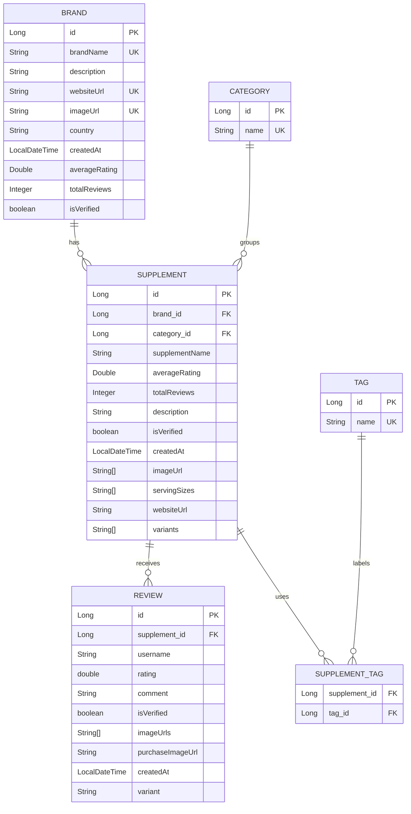

# Entity Relationship Diagram

## Notes

- `supplement_tag` is the join table created by `Supplement.tags`.
- `imageUrl`, `servingSizes`, `variants`, and `imageUrls` are represented as array-like fields because the Java entities use `List<String>`.
- `UK` marks fields declared with `unique = true`.
